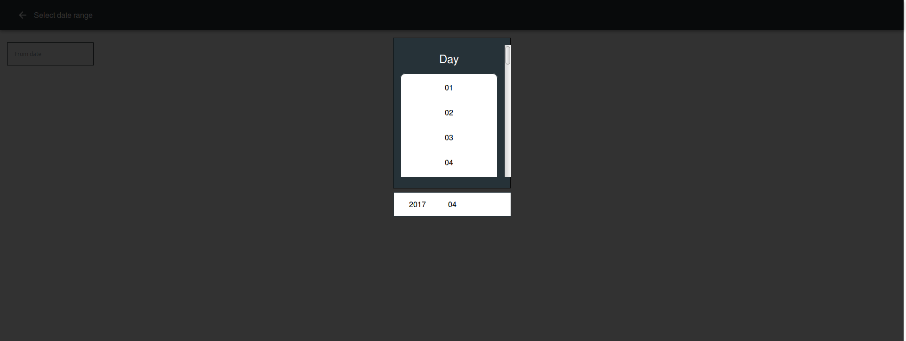

# simple-react-date-selector

A simple react date picker component.

**Preview:**


*Default styling:*


*Custom styling:*




**Props:**

|Prop|Required|Type|Description|
|---------|---------|---------|---------|
|onChange|true|function|The callback function that should be executed when the complete date is chosen. The argument is the date value that is returned.|
|onOpened|false|function|The callback function that should be executed as soon as the datepicker becomes visible|
|onClosed|false|function|The callback function that should be executed as soon as the datepicker is hidden|
|placeholder|true|string|The field label|
|value|true|string|The current value that should be displayed in the date field.|
|headerStyles|false|style object|Additional styles that should be added to the header - The day, month and year headings|
|bodyStyles|false|style object|Additional styles that should be added to the body -  The day, month and year options|
|containerStyles|false|style object|Additional styles that should be added to the container - The modal in which the day, month and year pickers are rendered|
|footerStyles|false|style object|Additional styles that should be added to the footer - The footer that displays the currently selected year, month and day|
|visible|false|boolean|You can programmatically set the visibility of the datepicker by specifying true (show the datepicker) or false (hide the datepicker)|

**Steps for including the component in your project:**

- run "npm init" in the root of your application to create a package.json file if your application doesn't have one yet.
- run "npm install simple-react-date-selector --save" OR "yarn add simple-react-date-selector" in the root of your ReactJS application.
- Include the SCSS file - When using "create-react-app" this file can easily be included by @importing it into your application's root SCSS file.
- Require the component at the top of your application's component where you want to use the date picker.

**Example usage:**

*Add the SCSS file to your application's root SCSS file - for example:*

```css
/*Remember to reference your node_modules directory correctly*/

@import "../node_modules/simple-react-date-selector/styles/simple-react-date-selector";
```

*Add it to your application's component - for example:*

```javascript
import React,{Component} from "react";

/*This is a default export so feel free to name it whatever you like. It doesn't have to be Datepicker */

import Datepicker from 'simple-react-date-selector';

export default class MyComponent extends Component{
    constructor(props){
        super(props);
        this.state={DateFrom:"",DateTo:""};
    }

    /*
        The first datepicker simply has the default styling
        The second datepicker component has been given custom styling
    */

    render(){
        return (
                <Datepicker  
                    onChange={date=>{this.setState({DateFrom:date})}}
                    placeholder={'From'}
                    value={this.state.DateFrom}
                    visible={true}
                />
                <Datepicker  
                    onChange={date=>{this.setState({DateTo:date})}}
                    placeholder={'To'}
                    value={this.state.DateTo}
                    headerStyles={{
                        backgroundColor:'#263238',
                        color:'white',
                        borderBottomWidth:0
                    }}
                    containerStyles={{
                        borderRadius:0,
                        backgroundColor:'#263238',
                        borderColor:'black',
                        borderWidth:1,
                        borderStyle:'solid'
                    }}
                    bodyStyles={{
                        borderRadius:10,
                        backgroundColor:'white',
                        borderWidth:1,
                        borderColor:'#263238',
                        borderStyle:'solid'
                    }}
                    footerStyles={{
                        borderRadius:0,
                        borderWidth:1,
                        borderColor:'#263238',
                        borderStyle:'solid'
                    }}
                />
        )

    }
}
```